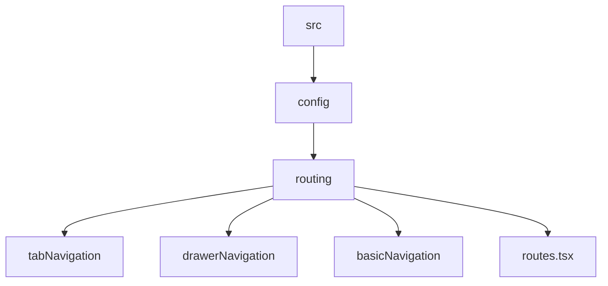

# Documento informativo provisional de Orión
La aplicación de Orión no había recibido actualizaciones desde hace un tiempo (3 años aproximadamente), por esa razón se decidió hacer una "actualización" de la misma creandola desde cero con las tecnologías, librerías y metodologías actuales.

A continuación se relacionan las librerías que continúan y que NO continúan con base al archivo `package.json`, así como las alternativas:

- ✔️ La librería continúa porque se le ha seguido dando soporte o su última actualización tiene un tiempo < 12 meses.
- ❌ La librería NO continúa porque está deprecada o su última actualización tiene un tiempo > 12 meses.

### DEPENDENCIAS USANDAS Y SUS ALTERNATIVAS ACTUALES

- lodash ❌ 🔄Usando Typescript
- native-base ❌ 🔄Cambiar. La documentación sugiere usar ✔️gluestack-ui
- prop-types ❌ 🔄Nativo de Typescript
- react-moment ✔️
- react-native-charts-wrapper ❌ 🔄Cambiar por chart.js
- react-native-display ❌
- react-native-floating-action ❌ 🔄Cambiar por react-native-reanimated
- react-native-gesture-handler ✔️
- react-native-image-picker ✔️
- react-native-indicators ❌ 🔄Cambiar por react-native-loader-kit
- react-native-modal-datetime-picker ✔️
- react-native-modalbox ❌ 🔄Cambiar por @whitespectre/rn-modal-presenter
- react-native-orientation-locker ❓
- react-native-pure-jwt ✔️
- react-native-reanimated ✔️
- react-native-safe-area-view ❌Deprecado 🔄Cambiar por react-native-safe-area-context
- react-native-slider ❌ 🔄Cambiar por @react-native-community/slider
- react-native-swipeout ❌ 🔄Cambiar por rn-swipe-action-button
- react-native-vector-icons ❌ Error en la configuración.
- react-native-walkthrough-tooltip ✔️
- react-native-webview ✔️
- react-navigation ❌Deprecado 🔄Cambiar por @react-navigation/native
- react-navigation-drawer ❌Deprecado 🔄Cambiar por @react-navigation/drawer
- react-navigation-stack ❌Deprecado 🔄Cambiar por @react-navigation/stack
- react-redux ✔️
- redux ✔️
- redux-persist ❌ 🔄Cambiar por una base de datos local
- redux-thunk ✔️
- rn-fetch-blob ❌ 🔄Cambiar por react-native-blob-util ó react-native-fs

### DEPENDENCIAS NUEVAS
- react-native-alert-notification 🆕Nueva dependecia para mostrar alertas.
- @react-native/material-top-tabs Y react-native-tab-view 🆕Nuevas dependecias para la navegación basada en pestañas.
- lucide-react-native 🆕Nueva dependencia para el uso de iconos.

## ASPECTOS QUE SUFRIERON CAMBIOS

### **Routing**
**V1.0.2**: En versiones anteriores del proyecto, la navegación y las rutas se resolvían desde un solo archivo donde convergían todos los tipos de navegación (basada en botones dentro de cada vista, basada en pestañas y basada en botones desde una sidebar).

**V2.0.0**: En esta versión se separarán los tipos de navegación por componente e importandolos en el componente `NavigationContainer` en el documento `routes.tsx`, esto con el objetivo de hacerlo más claro y segmentado.
La estructura es la siguiente:



### **Iconos**
**V1.0.2**: Se utilizaba la librería `react-native-vector-icons`, la cual resulta tediosa de configurar y usar según lo visto en la documentación de la librería.

**V2.0.0**: Se utilizará `lucide-react-native` que trabaja en conjunto con la nueva librería `gluestack-ui` que reemplazó a `react-base`, junto con otras de sus dependencias como `react-native-svg` que es la que permite el uso de iconos vectoriales.
Adiciona a lo anterior, se creó un archivo donde se importan todos los iconos de la librería y se agregan SOLO LOS QUE SE USARÁN en la app, esto con el objetivo de hacer más facil la busqueda de icono requerido y por efectos prácticos, su uso es el siguiente:

```
import {iconMap} from '../../config/icons/Icons'

DENTRO del componente donde será usado
const Icon = iconMap[iconName]

Uso
<Icon style={styles.icon} size={iconSize}/>
```

## Esquema de colores 🌈
### Colores principales
Colores que se usan a lo largo de toda la app:
- Color principal: `#fff`
- Color secundario (azul) : `#215877`
- Color de enlaces: `#5294ff`
### Otros colores
Colores que se usan en la app, pero en componentes más pequeños o con menos frecuencia:
- `#5EB85F`
- `#6FB9C3`

### Botones
Observando el esquema de colores que usan los botones a lo largo de la aplicación podemos inferir 3 tipos y el color que usan:
1. Configuración: `#5EB85F`
2. Visualización: `#5FB2F9`
3. Acciones: `#215877`(principal y swap buttons), `#5FB85F`(add y confirm buttons) y `#D85350`(cancel buttons).